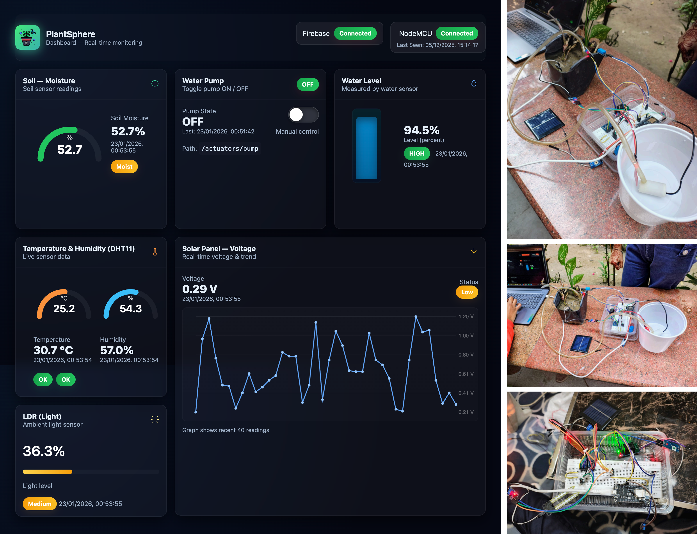

# 🌿 PlantSphere

**PlantSphere** is an interactive plant monitoring and visualization system that connects hardware sensors (NodeMCU) to a web-based interface. It allows users to track plant conditions in real-time and visualize data through an engaging interface.

---

## 🔗 Live Demo
**https://plant-sphere.vercel.app/**

  

---

## 📌 About the Project

PlantSphere integrates IoT hardware with a web application to monitor plant health. The NodeMCU collects sensor data (e.g., soil moisture, temperature, humidity), which is then sent to the web app to generate interactive visualizations. Users can view plant data, track growth, and get notifications or alerts.

---

## 🚀 Tech Stack

### **Hardware**
- NodeMCU (ESP8266)
- Sensors: Soil Moisture Sensor, DHT11 (Temperature & Humidity), Solar Panel, Voltage Sensor, Water Level Sensor, Pump, Relay, LDR Sensor

### **Frontend**
- HTML, CSS, JavaScript
- Charts.js for data visualization

### **Backend**
- Firebase Realtime Database (stores sensor data)
- Arduino IDE

---

## 📦 Features

✔ Real-time plant monitoring using IoT sensors  
✔ Interactive web visualization of plant conditions  

---

## 🛠️ Getting Started

To run the project locally:

### 1️⃣ Upload Arduino Code
- Open the Arduino IDE  
- Connect your NodeMCU  
- Upload the code from the `arduino-IDE-code.txt` to NodeMCU  

### 2️⃣ Connect Web App with Firebase
- Open `index.html`  
- Add your Firebase configuration (API key, project ID, etc.) in the appropriate section  
- Ensure your NodeMCU sends data to the Firebase database  

### 3️⃣ Open Web App
- Simply open `index.html` in your browser  
- The web app will display real-time plant data collected from NodeMCU

